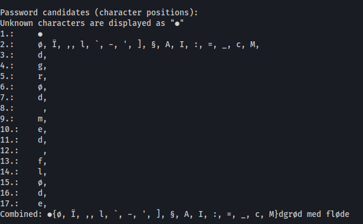
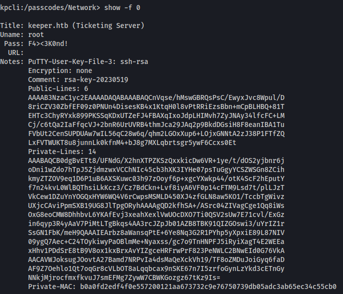

# Keeper

Nmap port scan indicated two open ports: 22/ssh and 80/http.
Port 80 runs instance of [request-racker](https://github.com/bestpractical/rt).

## Initial foothold
The standard root login `root:password` was not changed.
This allows an attacker to log in to the software as admin user.

## User flag
The admin panel of the web application shows that there is a user named `lnorgaard`.
In a note the system admin states, that the initial password was `Welcome2023!`.
This allows login via ssh to retrieve the user flag.

## System flag
The home directory of user `lnorgaard` contains a keepass database and a memory dump.
Investigating those given files shows that there is a [CVE-2023-32784](https://nvd.nist.gov/vuln/detail/CVE-2023-32784) which allows to retrieve the master password from memory dumps of keepass versions 2.x before 2.54.

After downloading the memory dump to my local machine, [keepass-password-dumper](https://github.com/vdohney/keepass-password-dumper) decoded most of the password:

Since the user is danish, I googled and figured out that the master password is `rødgrød med fløde `. This allows to inspect the keepass file `passcodes.kdbx`. I found a root user entry in the group `Network`:

Unfortunately, the shown password did not allow to log in as root.
But the given putty rsa key allow to login via ssh. 
The notes from the entry can be copied in to a file.
This file can then can be converted via `puttygen` to receive openssh keys, which can then be used with your linux ssh client: `puttygen putty_file -O private-openssh -o openssh-priv-key`

Finally, this key allows to login via ssh: `ssh root@keeper.htb -i ./openssh-priv-key`.