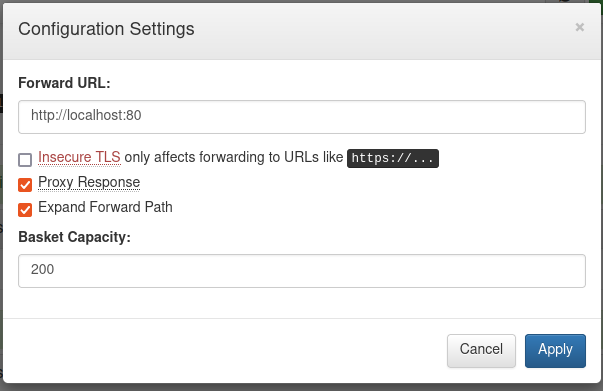

# SAU

## Analysis

- nmap scan reveals open ports `80` and `22` and `55555`
  - port 80 is filtered and can not be accessed
 
## Solution

### User flag
- port 55555 hosts `request basket` in version `1.2.1` which is vulnerable to server side request forgery (SSRF)
  - [CVE-2023-27163](https://nvd.nist.gov/vuln/detail/CVE-2023-27163): Request basket allows forwarding of request to a user-defined server. It also has the functionality to act as a complete proxy by forwarding the response of the user-defined server back to the request.
  - This vulnerability allows an attacker to access the application running on port 80 of the machine
  - Create a basket with the following settings: 
    - forward incoming requests to `http://localhost:80`
    - enable proxy response to forward the response of the proxy
    - enable path forwarding, so that we can also request other paths of the application (e.g. via `https://<ip>/<basket-name>/login` to perform a login attempt)

- port 80 hosts `maltrail` in version `0.5.3` which is vulnerable to unauthenticated RCE, [details here](https://securitylit.medium.com/exploiting-maltrail-v0-53-unauthenticated-remote-code-execution-rce-66d0666c18c5)
  - When the attacker performs a login attempt, the username parameter is passed as input for a system command
  - a login attempt which a specifically crafted username (e.g. `username=;whoami`) will allow to receive a reverse shell, see details in [exploit_maltrail.py](./exploit_maltrail.py)
  - this gives a shell as user `puma` to get the user flag

### Root flag
- `sudo -l`  
  - user puma can run `sudo /usr/bin/systemctl status trail.service`
  - if attacker has a proper terminal (e.g. via `python3 -c 'import pty; pty.spawn("/bin/bash")'`), this sudo command opens in a pager to provide a clear output
  - if pager is started, the attacker can execute `!sh` to receive a root shell

