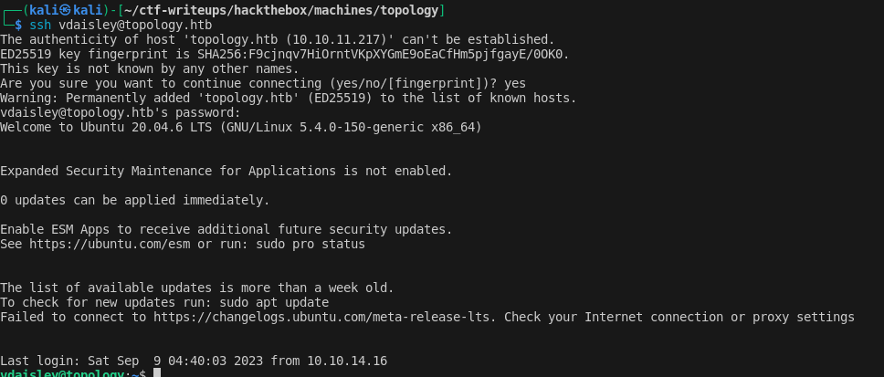
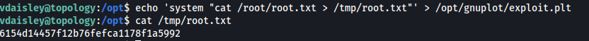

# Topology

## Initial foothold
The application running at http/80 renders user specified latex code into an image.
This is vulnerable to latex code injection.
The following payload allows to read `/etc/passwd`:
```
$\lstinputlisting{/etc/passwd}$
```

## User flag

1. Using the lfi vulnerability, the attacker can access the apache vhost configuration at `/etc/apache2/sites-enabled/000-default.conf`.
This leak shows the additional domains along with their document root directories:
    - `dev.topology.htb`
    - `stats.topology.htb`

2. Found the following credentials in `/var/www/dev/.htpasswd`:
    ```
    vdaisley:$apr1$1ONUB/S2$58eeNVirnRDB5zAIbIxTY0
    ```
    Cracked the hash using `hash-identifier` and `hashcat`.
    The password is `calculus20`.
3. This allows the attacker to authenticate against ssh and retrieve the user flag: `vdaisley:calculus20`
    


## System flag
1. Uploaded `pspy64` to the machine to observe processes.
2. Found a cronjob which is doing the following:
   - collects data about the network interfaces and the uptime of the server
   - a graph is created from the data using gnuplot
   - to create the graph, the cronjob searches all files `/opt/gnuplot/*.plt` and runs gnuplot on them
3. Gnuplot can be used to [run arbitrary system commands](https://exploit-notes.hdks.org/exploit/linux/privilege-escalation/gnuplot-privilege-escalation/)
4. Creating a malicious file `/opt/gnuplot/exploit.plt` with the following content allows to get the system flag once the cronjob is executed:
